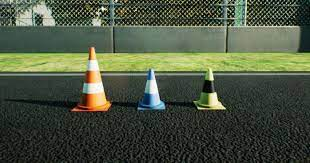

# Cone Detection For Formula Student

**The aim of this program is to identify cones used on the formula student track.**

There are 3 kinds of cones used in the competition:
1. Blue with white stripe to signify left edge of track
2. Yellow with black stripe to signify right edge of track
3. Orange with white stripe to signify start and end of track

This program aims to identify these different cones using OpenCV.

## coneDetector.py
This contains a list of specialised functions to detect cones.
As well as, functions to debug the pipeline.

### Debug mode
If enabled will show the output of every function that returns an image. \
Useful for visualising pipeline.
### Timer mode
If enabled will time each function.

### colorPicker in coneDetector.py
Used to find the colors of the cones, as different cameras produce slightly different colors,
the colors of the cones need to be changed, this function creates an interactive window to 
see the color you wish to find.

## main.py
This contains pipelines for different cones

## Basic pipeline
This pipeline is works for high definition images where only cones are clearly visible, 
but fails when there are other objects in the image.

The general pipeline all cone detection is as follows:
1. Extract color required (yellow, blue or orange) from the original image.
2. Extract either black or white from the original image.
3. Post-process these new images which runs canny detection and extracts edges.
4. Detect counters in the post processed image to see shapes and add the results to a mask
5. So far, the final image will contain the mask of the color and either black or white.
6. The final image is again post processed to detect edges.
7. The edges are then used to detect contours of the full cone.
8. Bounding boxes drawn around the cones.

## Complicated pipeline
This pipeline is more complicated as it takes into account the color of the cone and the
stripes being in the same area. 

The general pipeline all cone detection is as follows:
1. Extract either black or white from the original image. 
2. Post-process the image which runs canny detection and extracts edges.
3. Detect counters in the post processed image to see shapes
4. Create new image which only includes areas inside bounding box with margin.
5. Repeat steps 2-4 for the color from the masked image.
6. Follow basic pipeline.

## sampleColors.json
Contains sample colors with images.

## Challenges faced
* The cones are not a uniform color as they are broken up by a stripe, therefore the 
results of two different process need to be collated.
* Very few high definition sample/ training images can be found online therefore
some images had to be synthesised in Unity.
* The cone colors that appear in the camera change due to the time of day, different cameras,
different weather. Therefore, the pipeline should be flexible to allow for a range and easily changeable.
* The cone colors occur naturally such as the sky (blue) and dried grass (yellow)
therefore just extracting the colors is not enough to detect cones.
* THe images need to a normalised size to help the min and max size of contours
